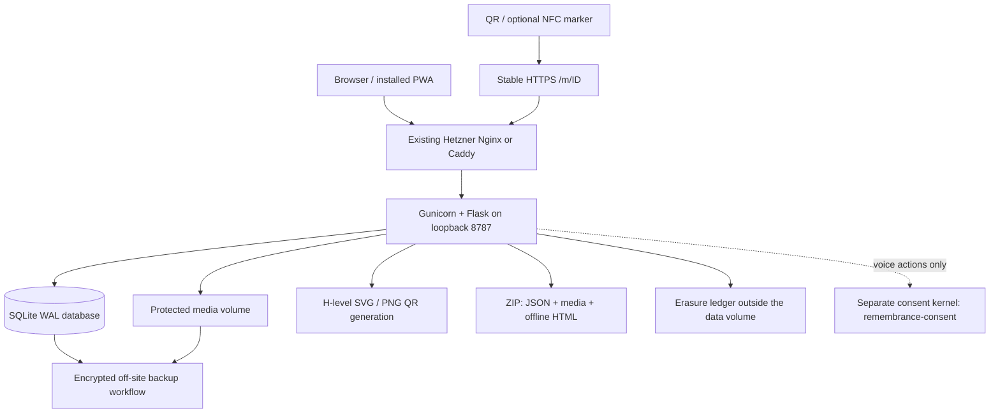

# Remembrance architecture — pilot release 3

## What has been built

A functioning Python/Flask application with server-rendered HTML, progressive enhancement, SQLite persistence, file-backed media, a production Gunicorn container, and an installable progressive web app (PWA). It is deliberately independent of The Saint in the parent directory. No existing personal data is imported automatically.

The public viewer needs no download. Installing the PWA creates a home-screen app; it is not an Android APK or an App Store binary. Owners can download a standalone offline archive. The default content is a clearly fictional example with no usable owner password.



## Working product flows

| Capability | Behavior in this release |
|---|---|
| Accounts | Registration, scrypt password hashing, signed HttpOnly/SameSite cookies, 12-hour sessions, login/logout; operator-assisted password recovery |
| Memorials | Multiple memorials, private default, edit biography/dates/location, public/family/private audience, archive and restore |
| Reviewed sharing | Opt-in sharing grants; operator review; optional activation after confirmed passing; owner/operator revocation; chained consent history |
| Authority | Typed authority declaration and timestamp; self / executor / authorized family options; no assertion of legal verification |
| Media | JPEG/PNG/WebP rewritten as JPEG with metadata removed; MP4/WebM/MP3/WAV/M4A validated by basic signatures; per-item audience; captions; portrait selection; archive/restore |
| Timeline | Dated chapters, per-item visibility, archive/restore, prepared JSON import initially private |
| Family | Read access granted only to an existing account with matching email and account code; immediate revocation on subsequent requests |
| Tributes | Public submission, affirmative consent, pending review, owner approval/archive, bearer-code permanent live-database withdrawal |
| Candles | Server-persisted daily browser dedication, 30-day retention; no public counters or engagement ranking |
| QR | Stable random memorial ID, H error correction, four-module quiet zone, SVG/PNG download, print keepsake |
| Portability | Owner ZIP includes stored media, all timeline/tribute states, consent, family list, audit metadata, JSON schema version, offline HTML viewer |
| Concerns | Privacy/copyright/authority reports persisted for owner and operator; operator CLI report queue; no automatic email delivery |
| Legacy | Account-bound nominations, recipient acceptance/withdrawal, owner cancellation and operator-reviewed transfer; existing URLs and consent controls preserved |
| Erasure | Owner request archives at once; operator-reviewed erasure of every memorial record and media file; off-database hash-chained ledger reapplied after restore |
| Offline | Static install shell only; explicit owner ZIP for complete offline memories |

## Data and permissions

`schema.sql` is the version-1 baseline; `migrations/002_consent.sql` adds reviewed sharing, `migrations/003_succession.sql` adds succession requests, and `migrations/004_erasure.sql` adds erasure requests and the erasure registry. Fresh databases initialize at `PRAGMA user_version=4`. Existing version-1 to version-3 databases require the explicit, backup-first upgrade in [the consent workflow](CONSENT-WORKFLOW.md). Startup rejects unsupported versions. Future changes require numbered migrations and a verified pre-migration backup.

- `users`: identity, password hash, created time. No social OAuth tokens.
- `memorials`: owner, story, consent, visibility, portrait reference, successor preference, archive state.
- `members`: memorial-specific family access, matched to an existing account.
- `media`: opaque storage filename, content type, caption, visibility, archive state.
- `events`: year, title/story, visibility, archive state.
- `tributes`: consented display name/text, moderation state, hashed withdrawal secret.
- `candles`: keyed visitor digest and date, with 30-day purge when a candle is lit.
- `audit`: action, actor ID, target ID, time. Does not copy deleted tribute text or historical biographies.
- `reports`: contact address, category, detail, processing state.
- `consent_controls`, `consent_grants`: opted-in release settings, operator confirmations, typed declarations and reviewed/revoked grants.
- `consent_events`: append-only consent lifecycle and decision history, with per-memorial SHA-256 chaining and off-host checkpoint verification.
- `succession_requests`: bound owner/nominee accounts, nomination-name snapshots, acceptance declarations, transfer review and prior authority provenance.
- `erasure_requests`: owner requests with typed name and declaration; withdrawn or operator-declined status. Deleted with the memorial.
- `erasures`: retained registry of erased memorial IDs, operator IDs, evidence digests and ledger positions; no content.
- `rate_limits`: keyed network digest and rolling hour buckets, no raw IP analytics.

| Resource | Public visitor | Granted family account | Owner |
|---|---|---|---|
| Public active profile | Read | Read | Read/write |
| Family active profile | Hidden | Read | Read/write |
| Private or archived profile | Hidden | Hidden | Read/write |
| Public media/chapter | Read if profile readable | Read if profile readable | Read/write |
| Family media/chapter | Hidden | Read if profile readable | Read/write |
| Private or archived media | Hidden | Hidden | Read/write |
| Pending/archived tribute | Hidden | Hidden | Moderate |
| Approved tribute | Read if profile readable | Read if profile readable | Moderate |
| Family grants, consent, reports, erasure requests, ZIP | Hidden | Hidden | Read/manage |

Every media request resolves both profile and item permission. For opted-in memorials, visitor access also requires a reviewed consent grant whose release conditions and audience permit it. Owners retain management, preview and export access. Revocation blocks subsequent requests; an already-authorized response may finish. See [the consent workflow](CONSENT-WORKFLOW.md) for review, revocation and history verification. File paths are not exposed through a public static directory. Names never become filesystem paths. Family access does not confer editing or moderation power. The public owner page is a preview of everything the owner can see; labels distinguish nonpublic items. Use a signed-out browser for an exact visitor view.

## Security and privacy boundaries

All mutating web routes require a CSRF secret; explicit cross-origin requests are rejected. Allowed Host values derive from the configured public origin. Jinja escapes submitted text, CSP prevents inline scripts, and uploads cannot execute as templates or scripts. Cookies require HTTPS in the production Compose deployment.

`TRUST_PROXY=1` trusts exactly one proxy for scheme and source IP. The port is bound to loopback, and the example Nginx configuration overwrites forwarded address headers. Never expose that listener directly or add extra proxy hops without reviewing trust and rate limiting. Behind an additional CDN, update the trusted-proxy design before launch. Do not cache responses with cookies, profiles, or authenticated media at a CDN.

Rate limits persist in SQLite across workers. Upload requests are capped at 32 MiB and stored files have a configurable total budget, default 1 GiB. Quota checks are advisory under concurrent uploads, not a billing-grade exact quota. MP4/audio signature checks are not antivirus scanning or full codec validation. No transcoding, malware scanning, resumable uploads, or media CDN is included. Add a quarantined media processing worker before a large public launch.

Disk and backups are not encrypted by the application. Configure encrypted host storage and encrypt backups separately; do not market encrypted-at-rest storage until the actual deployed storage has been verified. Server administrators can read the database and media. Session signing is not content encryption. The PWA never caches private pages/media, although a visitor can intentionally save anything they are authorized to see. Removing access cannot retract downloaded copies.

Registration does not send a verification email. Family grants require account-code confirmation outside the app. Before a large public launch, add verified email, self-service recovery, optional MFA, and monitored abuse controls. Operators must verify identity before password reset. Rotating SECRET_KEY invalidates all sessions and candle/rate-limit hashes.

## Permanence and erasure

Memorial IDs are 64-bit random hex strings, immutable across profile edits, and not reused. The route resolves directly to the database ID. Permanent physical markers encode the owned domain, not a third-party QR service. Keeping the same domain and importing the server backup preserves existing QR codes. A future platform migration must retain `/m/<id>` or serve a stable redirect to the new viewer.

Ordinary removal is archiving. Contributor withdrawal is permanent deletion of live tribute content; the action log retains an opaque ID. Permanent memorial erasure follows the reviewed [erasure workflow](ERASURE-WORKFLOW.md): an owner request or verified claim, operator review, one transaction removing every memorial record and media file, and an off-database ledger reapplied after any restore. Account erasure still requires an operator-run maintenance procedure after rights verification. Backups, previously exported owner archives, legal holds, and media featuring multiple people require a separate retention/erasure policy. Nothing here promises perpetual availability or prohibits lawful erasure.

The owner ZIP is a portable content package, not a full server restore: it omits account passwords and withdrawal secrets. The server backup format includes database plus media and can restore the service. These two formats intentionally serve different purposes.

## Prepared memory import

```json
{"format":"remembrance-import","version":1,"memories":[{"year":1985,"title":"A new garden","story":"We planted the first apple tree together."}]}
```

Import up to 100 chapters at once. Validation is atomic; everything is initially private. Review and change visibility explicitly. Reimporting creates duplicates, so review your file once before submission. No external accounts are scraped or connected. The Saint adapters handle personal digital-footprint analysis, not deceased-account authorization; they were not silently repurposed as social importers.

## Reviewed succession

Owners nominate an existing account using its confirmed email and account code. The nominee accepts or declines without receiving additional content access. An operator verifies authority and completes the transfer using the exact source and destination account IDs. The former owner loses management access; concurrent stale edits are rolled back. Existing consent grants, release conditions, content and memorial IDs remain in place. See [the succession workflow](SUCCESSION-WORKFLOW.md).

## Voice and the consent kernel

Decided 28 September 2026: this app keeps its own reviewed-sharing checks for memorial viewing, and voice actions (synthesis, script generation and message delivery) are authorized only by the separate consent kernel in `remembrance-consent/`. No voice feature is shipped yet. The kernel's `VIEW_MEMORIAL` action is not used by this app.

`kernel_client.py` is the only path to voice authorization. For each request it signs a five-minute HS256 identity assertion with the key shared with the kernel, asks `POST /consent/authorize` for one action on one kernel profile under that action's fixed purpose, and returns the kernel's signed token. Every other outcome is a denial: missing configuration, an unreachable kernel, a rejected assertion, a redirect, a malformed or oversized reply, or an approval that does not match the request.

Configure both settings or neither; a half configuration stops startup.

- `REMEMBRANCE_CONSENT_KERNEL_URL`: the kernel's base URL. Use HTTPS or a loopback or private network, because assertions are bearer credentials.
- `REMEMBRANCE_AUTH_JWT_KEY`: the same value as the kernel's `REMEMBRANCE_AUTH_JWT_KEY`, at least 32 bytes, with the kernel on its default HS256 algorithm. If the kernel changes `REMEMBRANCE_AUTH_JWT_ISSUER` or `REMEMBRANCE_AUTH_JWT_AUDIENCE`, set the same values here.

`flask --app app kernel check` confirms that the kernel is reachable and accepts this app's assertions, using reads only.

Assertions carry the account ID as `sub`, no roles and no email, because this app does not verify email addresses and the kernel trusts only verified ones. Voice actions belong to a grant's grantor, or its designated successors under a pre-need grant, matched by account ID, so they do not need email. Named beneficiaries acknowledge grants by verified email and cannot do so through this app until it verifies addresses. Kernel administration, such as authority review and death records, happens outside this app.

The first voice feature must:

1. Record which kernel profile belongs to each memorial, in a table that erasure removes. The erasure schema test enforces the removal.
2. Call `kernel_client.authorize_voice` for every action and send the token to the service doing the work in its `X-Consent-Authorization` header. Never reuse a token for another action.
3. Store `consent_grant_id` on every voice artifact in the shape of the kernel's `app/downstream/models.py`, so revocation can find and delete it.
4. Revoke the memorial's kernel grants when erasing it here. This app's erasure does not reach the kernel; the kernel's revocation cascade deletes voice models and audio.

The kernel's test suite loads `kernel_client.py` directly in `tests/consent/test_web_app_contract.py`, so its CI fails when either side breaks the contract.

## Capacity and evolution

This is a single-host pilot. SQLite WAL suits a modest number of concurrent families with short writes. Deploy one app service with two Gunicorn workers, local SSD, persistent volume, and monitored capacity. Do not place SQLite on a network filesystem or horizontally scale this Compose service. The 512 MiB temporary filesystem bounds archive generation; large archives need a larger protected temp volume and corresponding resources. Load-test your actual media and concurrency before changing limits.

At increased scale: migrate relational data to PostgreSQL using explicit migrations; move media to private S3-compatible storage and issue short-lived authorized delivery URLs; add asynchronous processing/quarantine and outbox-backed notifications; retain immutable memorial URLs. The permission checks and export format remain the contract. Public CDN caching would need invalidation for withdrawals and visibility changes.

Not shipped: social OAuth/platform-specific import, billing/tiers, plaque checkout/fulfillment, native app-store packages, NFC programming UI, voice cloning, AI biography/moderation, user analytics, multilingual content, automatic succession, self-service account deletion, replicated storage, contracted permanence, or external escrow. These require separate engineering, credentials, policy decisions, and in some cases explicit recorded consent. They are not represented as active features in the app.
